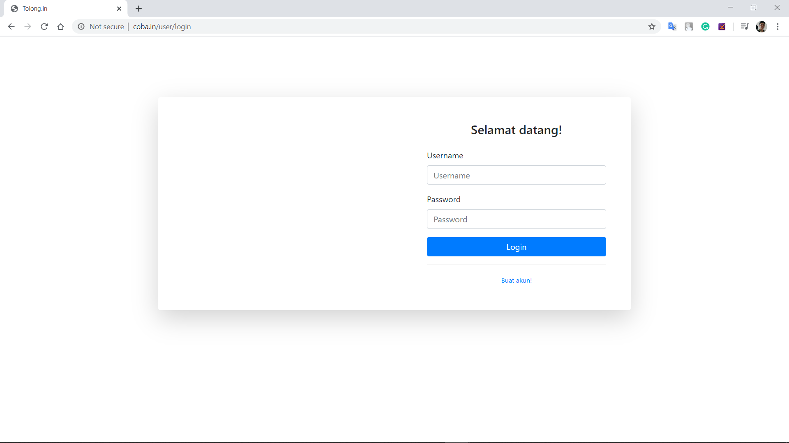
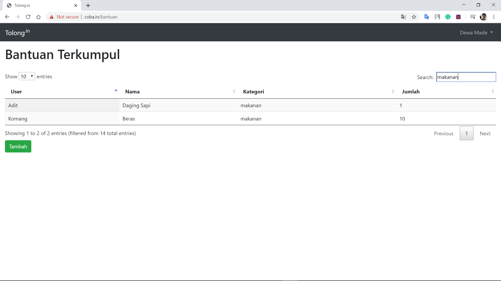

# FINAL PROJECT PBKK

I Dewa Putu Wiprah Adwityam 05111740000152
   Aplikasi ini bertujuan untuk melakukan pendataan terhadap bantuan dan juga mengirimkan bantuan selama pandemi covid-19

# Melakukan Login

Pada fitur ini user dapat melakukan login bila sudah mendaftarkan akun

Bila username / password yang diisikan salah, maka akan muncul notifikasi seperti berikut

# Membuat akun

Bila user belum memiliki akun, maka user dapat membuat akun terlebih dahulu dengan mengklik "Buat akun!" yang ada di bawah form login

Setelah mendaftarkan akun maka user akan otomatis diarahkan ke Login Page

# Melihat list bantuan

Setelah melakukan Login, maka user dapat melihat list bantuan semua user

Untuk membuat bantuan, user mengklik tombol "Tambah" dan akan diarahkan ke Page menambah bantuan

# Menambah bantuan

Setelah mengklik tombol "Tambah", maka user akan diarahkan ke Page menambah bantuan

Setelah itu user memasukan banyaknya jenis barang yang ingin disumbangkan dan mengklik tombol "Submit". Setelah user mengklik tombol "Submit", maka akan muncul form untuk memasukan barang sesuai dengan banyaknya jenis barang yang ingin disumbangkan

Setelah mengisikan data barang yang ingin di sumbangkan, maka user mengklik tombol "Submit" berwarna biru, setelah itu user akan diarahkan ke page List Bantuan dan akan muncul notifikasi bahwa data sudah berhasil disimpan 

# Fitur pencarian

User dapat melakukan pencarian terhadap kategori pada List Bantuan dengan mengetikan kata kunci pada kolom search bar

# Logout

User dapat melakukan LogOut dengan mengklik nama user yang ada di pojok kanan atas Page, maka akan muncul pilihan untuk LogOut, setelah mengklik "LogOut" maka user akan diarahkan ke page Login

# CONTOH TRANSAKSI

Setelah user melakukan login, maka user akan diperlihatkan List Bantuan

Setelah itu user mengklik tombol "Tambah", setelah itu akan muncul form baru, masukan jumlah jenis barang yang ingin disumbangkan

Lalu akan muncul form untuk mengisikan data barang sesuai dengan jumlah yang dimasukan user pada proses sebelumnya

Setelah itu user mengklik tombol "Submit" berwarna biru, setelah itu akan muncul notifikasi bahwa data sudah berhasil disimpan dan barang akan otomatis ditambahkan di List Bantuan

Dapat dilihat dari jumlah entry bahwa data entry sudah bertambah 2, dari 14 menjadi 16 sesuai dengan jenis barang yang dimasukan oleh user
